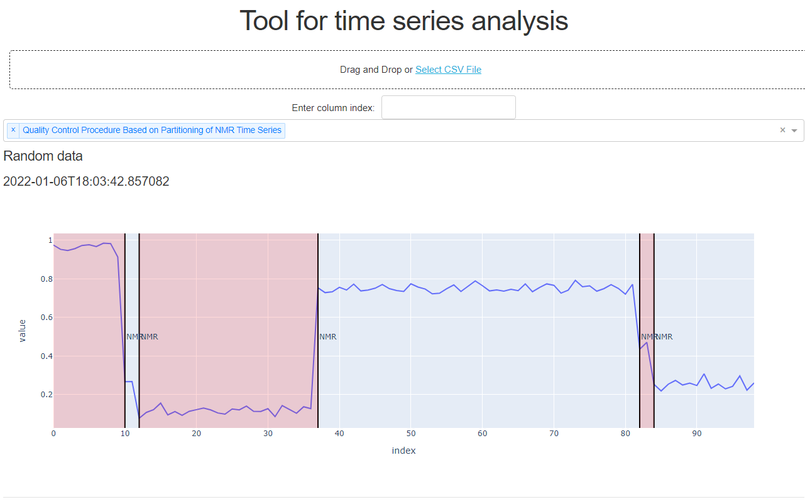
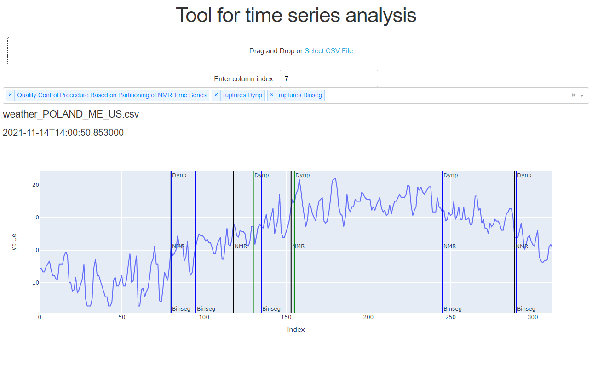

# Tool for time series analysis

This tool is equipped with two general-purpose methods, the first uses the dynamic programming approach, the second - binary segmentation, and the third, specialized method developed as a component of a new quality control method of MRI spectroscopy also using the dynamic programming approach.

*Application after loading*

*The application after uploading the data file and selecting all segmentation methods*

## References
Quality control procedure based on partitioning of NMR time series:
> - Michał Staniszewski, Agnieszka Skorupa, Łukasz Boguszewicz, Maria Sokół, Andrzej Polański. Quality control procedure based on partitioning of nmr time series. Sensors, 18(3), 2018.

ruptures Dynp, Binseg:
> - Charles Truong, Laurent Oudre, Nicolas Vayatis. Selective review of offline change point detection methods. Signal Processing, 167:107299, 2020.